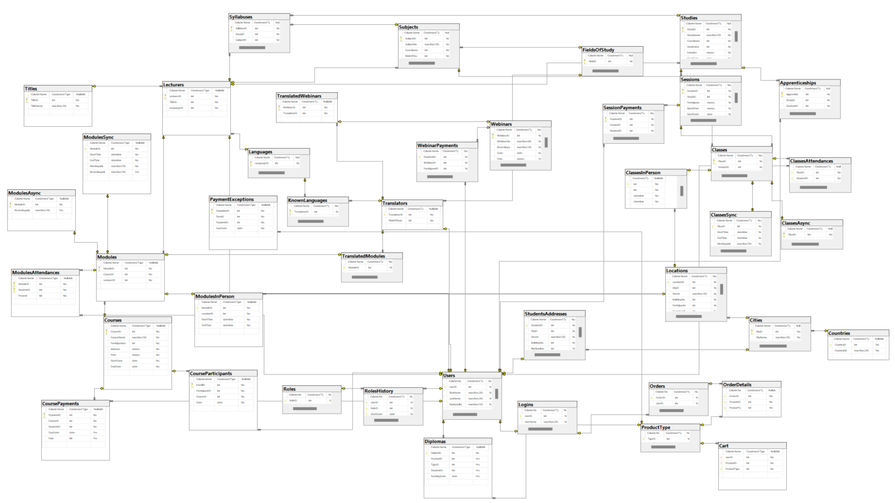

# "Database System for company offering various types of courses and training"  🚀📊

## Description

This project was completed as part of the Database Systems course at AGH 2023/2024 in collaboration with <a href="https://github.com/Karol0801">Karol0801</a> and  <a href="https://github.com/king-zar">king-zar</a>. 
The aim of the project was to design a database system for a company offering various courses and training programs, 
which have been digitized to varying degrees due to the COVID-19 pandemic. 

## Visual Representation 💡

Below is a visual representation of the database schema:

#### *Details about the project are included in the Instruction.pdf file.*
